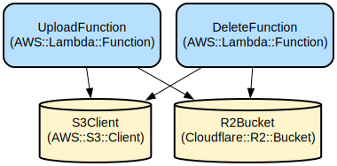

# Divinely Store - A Modern Link Management Platform with Category Organization

Divinely Store is a full-featured link management platform that enables users to organize, categorize, and share web resources efficiently. Built with Next.js 14 and TypeScript, it provides a seamless experience for managing links with rich metadata, custom thumbnails, and hierarchical categorization.

The platform combines robust authentication, granular access control, and cloud storage integration to deliver a secure and scalable solution for both individual users and administrators. With features like OTP verification, S3-compatible storage for thumbnails, and a responsive UI built with HeroUI components, Divinely Store offers a modern approach to link organization and sharing.

## Repository Structure
```
.
├── app/                      # Next.js application routes and API endpoints
│   ├── api/                  # API routes for auth, categories, links, and uploads
│   ├── auth/                 # Authentication-related pages
│   └── [id]/                # Dynamic routes for link viewing/editing
├── components/               # React components organized by feature
│   ├── auth/                # Authentication components
│   ├── dashboard/           # Dashboard views and management interfaces
│   └── ui/                  # Reusable UI components
├── lib/                     # Core utilities and configuration
├── models/                  # Mongoose data models
├── server-actions/          # Server-side actions for data operations
└── utils/                   # Utility functions and email templates
```

## Usage Instructions
### Prerequisites
- Node.js 18 or later
- MongoDB database
- Cloudflare R2 or compatible S3 storage
- Environment variables configured for:
  - Database connection
  - Authentication settings
  - Storage credentials

### Installation
```bash
# Clone the repository
git clone <repository-url>

# Install dependencies
npm install

# Set up environment variables
cp .env.example .env.local

# Start development server
npm run dev
```

### Quick Start
1. Register an account using email verification:
```typescript
// POST /api/auth/register
const response = await axios.post('/api/auth/register', {
  email: 'user@example.com',
  password: 'securepassword'
});
```

2. Create a new link:
```typescript
// POST /api/link
const response = await axios.post('/api/link', {
  title: 'Example Link',
  url: 'https://example.com',
  category: 'technology',
  description: 'An example link'
});
```

### More Detailed Examples
1. Managing Categories:
```typescript
// Create a new category
const category = await axios.post('/api/category', {
  name: 'Technology',
  icon: 'tech-icon'
});

// Get all categories
const categories = await axios.get('/api/category');
```

2. Uploading Thumbnails:
```typescript
const formData = new FormData();
formData.append('file', imageFile);
formData.append('filename', 'thumbnail.jpg');

const upload = await axios.post('/api/s3-upload', formData);
```

### Troubleshooting
1. Authentication Issues
- Error: "Maximum OTP count reached"
  - Wait for 10 minutes before requesting a new OTP
  - Check spam folder for OTP emails
  - Contact support if issues persist

2. Upload Problems
- Error: "File size exceeds limit"
  - Ensure images are under 1MB
  - Convert to supported formats (JPG, PNG, GIF)
  - Check network connection

## Data Flow
The application follows a structured data flow for managing links and categories.

```ascii
User Input → API Routes → Server Actions → Database
     ↑          ↓             ↓              ↓
  UI Components ← Server Response ← Data Models ← Storage
```

Key interactions:
1. Authentication flow uses NextAuth.js with custom OTP verification
2. Link creation includes metadata extraction and thumbnail upload
3. Category management enforces hierarchical organization
4. S3 storage handles media assets with secure access control
5. Server actions provide type-safe database operations

## Infrastructure


### Storage
- Cloudflare R2 bucket for thumbnail storage
- S3-compatible API endpoints for file operations
- Secure credential management through environment variables

### Authentication
- NextAuth.js integration with custom providers
- OTP-based email verification
- Role-based access control (admin/user)

### Database
- MongoDB with Mongoose models
- Structured schemas for Users, Links, Categories
- Optimized queries with proper indexing